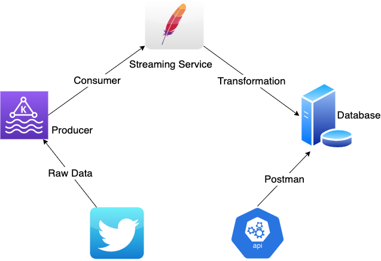

# Twitter Producer

Twitter Producer gets data from Twitter based on some keywords and puts them in a Kafka topic, and then consumes with streaming service and sink into some database then creates an API service to get required data from the database server.

# Basic Architecture



## Tech stack
- Python version: 3.10.1
- IDE: PyCharmCE
- MongoDB migrated distribution
- Kafka Distribution
- PySpark - Spark Streaming
- GUI tool: MongoDB Compass
- Flask
- Postman - API Testing tool

## Installation of Required Services

### Kafka (Brew)

```bash
# Prerequisite for kafka
brew install java
# Install kafka (upto 5 min)
brew install kafka
# List services
brew services list
# May require to uncomment last 2 line as showed below
vi /opt/homebrew/etc/kafka/server.properties
```

- Change the following in the file `/opt/homebrew/etc/kafka/server.properties`

```bash
# The address the socket server listens on. It will get the value returned from
# java.net.InetAddress.getCanonicalHostName() if not configured.
#   FORMAT:
#     listeners = listener_name://host_name:port
#   EXAMPLE:
#  listeners =PLAINTEXT://your.host.name:9092
listeners=PLAINTEXT://:9092
advertised.listeners=PLAINTEXT://localhost:9092
```
```bash
# Start the services
brew services start zookeeper
brew services start kafka
# Create kafka topic
kafka-topics --create --topic test-topic --bootstrap-server localhost:9092 --replication-factor 1 --partitions 4
# Create producer console
kafka-console-producer --broker-list localhost:9092 --topic test-topic
> hello-world
> I am twitter producer
# Create consumer console in another terminal
kafka-console-consumer --bootstrap-server localhost:9092 --topic <topic_name> --from-beginning
hello-world
I am twitter producer
# To delete Kafka Topic
kafka-topics --bootstrap-server localhost:9092 --delete --topic <topic_name>
# To list down all the topics
kafka-topics --list --bootstrap-server localhost:9092
```

### MongoDB

```bash
brew tap mongodb/brew
brew install mongodb-community
brew services start mongodb-community
```

#### Mongo Compass

[Download Link](https://www.mongodb.com/docs/compass/current/install)
## To Run

- Run app/producer python file. (Twitter to Kafka)

```bash
python3 app/producer.py
```

- Start Consumer Service with Spark Submit (Kafka to Mongo with Spark Streaming)

```bash
python3 app/consumer.py
or
spark-submit --class demo --packages org.apache.spark:spark-sql-kafka-0-10_2.12:3.2.0,org.mongodb.spark:mongo-spark-connector_2.12:3.0.1 consumer.py
```

- Start Server (Flask app API to Mongo Server)
```bash
python3 server/app.py
```